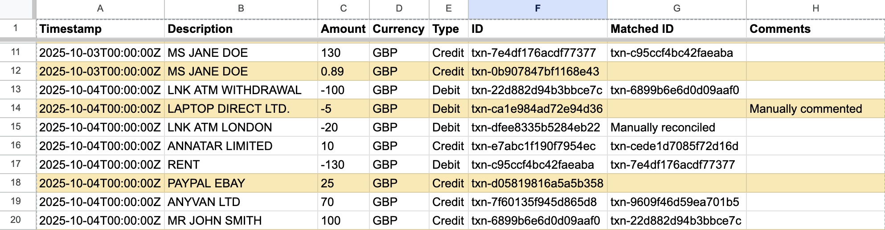

# credit-card-tracker

Synchronise and reconcile credit card transactions to Google Sheets via Open Banking.



The reconciliation process matches debits to the nearest credit with the same transaction value, allowing you to see which transactions remain to be paid off. Any manually annotated matches are preserved in the spreadsheet and not considered for automatic matching.

A variety of card providers are supported (e.g. Amex) via Open Banking. Each card is synced to a separate tab in the spreadsheet.

## Setup

### Google

You need to create a project in Google Cloud to access the Sheets and Drive APIs.

1. Go to the [Google Cloud Console](https://console.cloud.google.com/):
    * Create a new project.
1. Go to "APIs & Services" > "Library":
    * Search for and enable **Google Sheets API**.
    * Search for and enable **Google Drive API**.
1. Go to "Google Auth Platform" > "Branding":
    * App name: `credit-card-tracker`.
    * User support email: **your own**.
    * Contact information: **your own**.
1. Go to "Google Auth Platform" > "Audience":
    * Audience: **External** (or "Internal" if you have a Google Workspace organisation).
    * Test users: **your own**.
1. Go to "Google Auth Platform" > "Clients" > "Create client":
    * Application Type: **Desktop**.
    * Name: **credit-card-tracker**.
    * Copy "Client ID" and "Client Secret" to `config.toml`.

The utility only has access to the files that it creates. No additional scopes are required under "Data access".

### TrueLayer

You need a free TrueLayer account to fetch transactions through Open Banking.

1. Sign up at the [TrueLayer Console](https://console.truelayer.com/).
1. Create a new App:
    * Application name: **credit-card-tracker**.
    * Client ID prefix: **credit-card-tracker**.
    * Copy "Client ID" and "Client Secret" to `config.toml`.
1. Go to "Product UI":
    * Data use description: **Personal Finance Manager**
1. Go to "Settings":
    * Redirect URIs: **http://localhost:3000/callback**

A separate Client ID prefixed with `sandbox-` and Client Secret are available for developing against the Sandbox environment.

### Build

Install [Flox](https://flox.dev/).

To build a release:

1. Activate the environment: `flox activate`
1. Build the package: `flox build`
1. The binary will be on your `PATH` as: `credit-card-tracker`

For development:

1. Activate the environment: `flox activate`
1. Run the tests: `cargo test`
1. Run the utility: `cargo run <args>`

### Config

To see the config and cache paths that the utility uses:

```shell
credit-card-tracker show paths
```

An example config file is provided as [`config.toml.example`](./config.toml.example) which can be edited and copied into place.

## Usage

To sync, which will authenticate if necessary:

```console
% credit-card-tracker sync
2025-12-03T00:02:05.888933Z  INFO Sync:Syncing card{card=British Airways American Express® C}: credit_card_tracker::sync::engine: Card synced total=115 new=38 matches=20
2025-12-03T00:02:05.889190Z  INFO credit_card_tracker::cli::sync: Sync completed url="https://docs.google.com/spreadsheets/d/REDACTED"
```

Other commands are available:

```console
% credit-card-tracker --help
Sync credit card transactions from TrueLayer to Google Sheets

Usage: credit-card-tracker [OPTIONS] <COMMAND>

Commands:
  auth  Authenticate with providers
  sync  Sync transactions from TrueLayer to Google Sheets
  show  Show resources
  help  Print this message or the help of the given subcommand(s)

Options:
  -v, --verbose...  Verbose mode (-v for info, -vv for debug)
  -h, --help        Print help
  -V, --version     Print version
```
